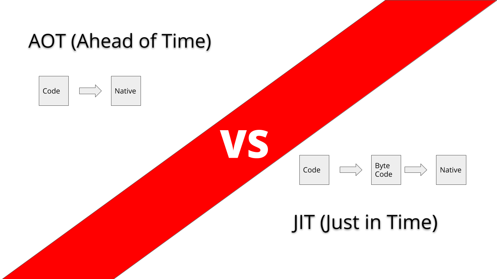
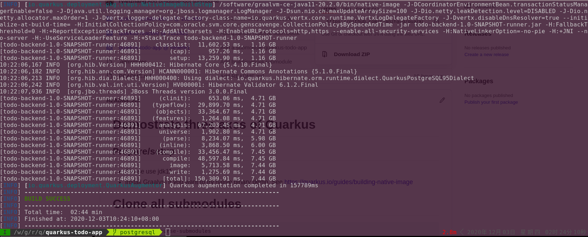

> 原文地址： https://dzone.com/articles/aot-compilation-make-java-more-power

在本文中，我将介绍如何使用 Java AOT 编译来消除 Java 中的死代码，从而显著提高性能。

我在 [之前的文章](https://dzone.com/articles/build-time-boot-refine-java-framework) 中尝试，简单的 hello world spring boot rest 应用程序需要加载大约 6000 个类。  虽然 Quarkus 版本似乎进行了优化，将数量减少到 3300+ ，但仍然太多了。 在本文中，我将介绍如何使用 Java AOT 编译来消除 Java 中的死代码，从而显著提高性能。



本实验使用 Quarkus 作为框架。

如果您更喜欢观看视频以获取主要想法，则可以直接在本文中查看 [youtube](https://www.youtube.com/watch?v=sHyauJKGAMM) 。

## 两个角度看Java性能

### 首次响应时间

Java 应用程序具有预热效果。 当它们在像 Kubernetes 这样的容器平台上运行时，这并不是一个迷人的特性。

因为在高度动态的环境中，应用程序来去匆匆，就像新陈代谢一样。 在无服务器架构下，应用生命周期非常快。 因此，预热效应会使 Java 应用程序变得不协调。

有两个众所周知的原因导致这种情况：

1. 延迟初始化

  传统上，延迟初始化是一种通过将任务推迟到请求到来时来优化和节省内存和 CPU 资源的策略。  Java 框架和服务器在历史上尤其以使用它而闻名，有时这种技术被积极使用。 容器环境不喜欢此功能。

2. JVM 预热

  这就是 JVM 的本质。 JIT 编译行为是选择性地编译热代码，即所谓的hotspot OpenJDK。 这意味着它只会对热路径中的代码进行二级优化，并且 JVM 在应用程序预热之前不会进行优化。

### RSS（全进程内存消耗）

RSS（Resident Set Size/驻留集大小）表示整个进程的内存消耗。

Java应用程序通常占用大量内存，即使是 hello world 应用。 比方说一个 spring-boot hello world 程序需要：

1. JVM（仅 [JVM 11 大小](https://www.google.com/search?safe=active&ei=hWvMX9-zLYX39QOr06zgBw&q=openjdk+11+size) 为 260+M）
2. 应用服务器，例如 Tomcat，或 vertx、netty 或 undertow，取决于您的选择，使您能够运行服务器和 servlet 。
3. 一些智能框架使您能够进行智能 Java 编程。

想象一下，加载的东西有多少是与启动 hello world 逻辑无关的。

但是，为什么它现在很重要，但以前不重要呢？ 这是因为，在容器和微服务流行之前，成本是分摊的。 多个 Java 应用程序（如“war”）或单个大型单体应用共享单个 JVM 和应用服务器。

## Java AOT 编译消除死代码

这个想法并不新鲜。 Oracle 于2018年4月宣布了 [Graalvm项目](https://blogs.oracle.com/developers/announcing-graalvm); 它包括一个原生映像工具，可以将基于 JVM 的应用程序转换为原生可执行二进制文件。

它看起来像这样：

```bash
$ native-image -jar my-app.jar \
    -H:InitialCollectionPolicy=com.oracle.svm.core.genscavenge.CollectionPolicy$BySpaceAndTime \
    -J-Djava.util.concurrent.ForkJoinPool.common.parallelism=1 \
    -H:FallbackThreshold=0 \
    -H:ReflectionConfigurationFiles=...
    -H:+ReportExceptionStackTraces \
    -H:+PrintAnalysisCallTree \
    -H:-AddAllCharsets \
    -H:EnableURLProtocols=http \
    -H:-JNI \
    -H:-UseServiceLoaderFeature \
    -H:+StackTrace \
    --no-server \
    --initialize-at-build-time=... \
    -J-Djava.util.logging.manager=org.jboss.logmanager.LogManager \
    -J-Dio.netty.leakDetection.level=DISABLED \
    -J-Dvertx.logger-delegate-factory-class-name=io.quarkus.vertx.core.runtime.VertxLogDelegateFactory \
    -J-Dsun.nio.ch.maxUpdateArraySize=100 \
    -J-Dio.netty.allocator.maxOrder=1 \
    -J-Dvertx.disableDnsResolver=true
```


当通过以下方式构建应用程序时：

`./mvnw package -Pnative`

将得到：



Quarkus-maven-plugin 完成了所有艰苦的工作，并为我们自动配置了原生构建选项的所有配置。

性能对比明显；下图引用自 [quarkus.io](http://quarkus.io/)：

现在让我们关注 Quarkus 原生模式（绿色）和 Quarkus JVM 模式（蓝色）的对比。 （如果你对 Quarkus 在 JVM 模式下的不同表现感兴趣，我在 [之前的文章](https://dzone.com/articles/build-time-boot-refine-java-framework) 中探讨了构建时启动是如何提高性能的。 ）

我将测试一个真实的用例：一个使用 hibernate 连接 PostgreSQL 的 todo 应用程序。

我录制了一个简短的视频来反映性能影响：

基本上，在视频中，我演示的是：

1. RSS 原生模式比 JVM 模式低 **7 倍**。
2. 我可以在原生模式下轻松启动 **250** 个应用程序实例。 相比之下，50 个 JVM 模式实例就会导致我的 CPU 非常繁忙。
3. 首次响应的时间差异也很大。  而原生与 JVM 的可伸缩性是 250 比 25。

所以 Java 原生模式的运行性能是很有前途的。

如果您更喜欢编写代码并自己查看，这里是 [代码和指南](https://github.com/ryanzhang/todo-demo-app/tree/postgresql)。

## Java AOT 如何工作

从图表和实验来看，Java AOT 编译表现出色。 现在让我们看看它是如何工作的。

首先，我们需要从传统的角度来理解; Java 使用 JIT 机制来运行 java 字节码。

当应用程序开始运行时，java 命令将启动 JVM 并在运行时解释和编译行为。 为了即时优化此编译，我们进行了许多优化。 使用大量的代码缓存技术。  实现这一点的一个重要驱动因素是实现跨平台兼容性。

AOT 在运行前（即构建时）将字节码直接编译为原生二进制文件。 因此，您将绑定到特定的硬件架构。  它只编译为x86架构，并放弃了另一个架构兼容性。 这种权衡是值得的，因为我们的场景只针对已经在云中无处不在的 Linux 容器。

此解决方案存在两个主要的技术挑战。

## 将“开放世界”Java 变成“封闭世界”Java

难度与您使用的 Java 依赖项的数量成正比。 经过 25 年的发展，Java 生态系统庞大而完整。

这么多年来，java 之所以成为 java，是因为它是一种动态编译语言，而不是一种静态语言。 它提供了许多功能，如反射、运行时类加载、动态代理、运行时生成代码等。 许多事实上的特性，如注释驱动编程（声明式）、CDI 依赖、java lambda 依赖于那些 Java 动态特性。 从头开始将字节码转换为原生二进制文件绝不是一条简单的事情。

在我的演示中，我使用 hibernate + PostgreSQL 做了一个 TODO 应用程序，它在原生模式下运行良好。  这是因为 Quarkus 社区已经优化了大量的库和框架。

如果您的应用程序对现有的 [quarkus 扩展列表](https://gist.github.com/ryanzhang/93455ad9e13cd699d7433282204f6518) （即优化的库，我通过运行 quarkus 1.8.3.Final 生成列表）没有问题，那么您应用程序的 Java AOT 是高度可行的，一点也不难。

## 调整 Graalvm 命令镜像的配置

幸运的是，这已经由 quarkus-maven-plugin 顺利处理。 您需要做的是在运行 mvn 来指定 -Pnative。 我永远不会愿意自己动手做原生图像命令。

总而言之，Java Aot 编译对于提高 Java 性能来说看起来非常有希望。 但是，对于大多数开发人员来说，这似乎也非常具有挑战性。

选择一个简单的路径非常重要，评估您的应用程序是否可以完全转换为原生也很重要。 我建议您阅读 https://quarkus.io/guides/building-native-image，了解进一步的构建原生执行信息。