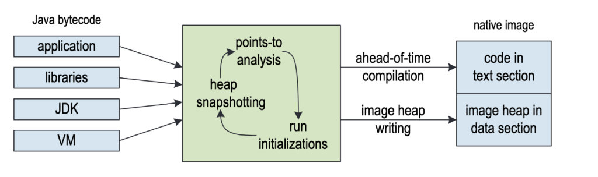
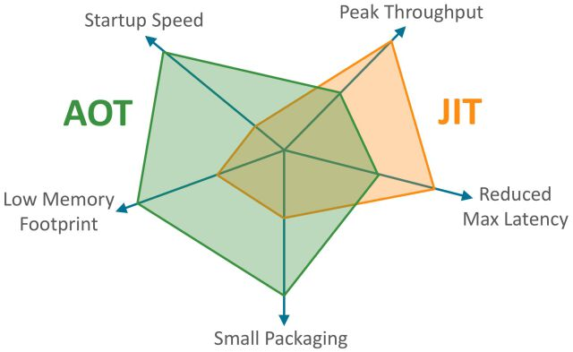
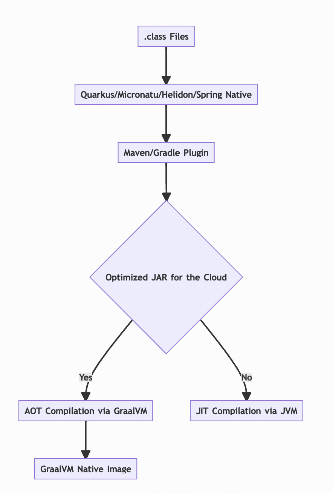

> 原文地址：[AOT vs. JIT Compilation in Java](https://www.cesarsotovalero.net/blog/aot-vs-jit-compilation-in-java.html)

编译 Java 应用程序有两种方法：实时编译 （Just in Time/JIT） 或提前编译 （Ahead of Time/AOT）。 第一种是默认模式， [Java Hotspot 虚拟机](https://www.oracle.com/java/technologies/javase/vmoptions-jsp.html) 使用它在运行时将字节码转换为机器码。 后者由新颖的 [GraalVM](https://www.graalvm.org/) 编译器支持，并允许在构建时将字节码直接静态编译成机器码。 在这篇文章中，我将解释这两种编译策略之间的差异。 阅读这篇文章后，您将了解 Java 编译器的功能、现有编译方法之间的差异，以及在哪些情况下使用 AOT 编译器更合适。

© JIT 与 AOT：同一枚硬币的两个面。 照片来自 [tekniska Högskolan站](https://goo.gl/maps/j8GC4KtHEXoKxLpB8)。

## Java 编译

编译程序意味着 **将源代码** 从高级编程语言（例如 Java 或 Python）转换为 [机器代码](https://en.wikipedia.org/wiki/Machine_code)。 机器代码是为在特定微处理器中执行而定制的低级指令。 编译器是旨在有效执行此任务的程序。 编译器的目标是创建已编译程序的一致可执行文件。 一致的可执行文件是按照源代码中编写的规范实现的可执行文件，运行速度快，并且是安全的。

编译器在机器代码生成阶段执行多个 [优化](https://en.wikipedia.org/wiki/Category:Compiler_optimizations)。 例如，大多数编译器在编译时执行常量内联、循环展开和部分求值，仅举几例。 在过去的几十年里，这些优化的数量和复杂度都有 [显著增加](https://en.wikipedia.org/wiki/Optimizing_compiler)。

在~~standard~~ Java Hotspot 虚拟机中的编译器优化方面，主要有两种编译器：C1编译器和C2编译器。

- **C1 编译器** 是一个快速、轻微优化的字节码编译器，它执行一些值编号、内联和类分析。 它使用简单的面向 CFG 的 SSA“high”IR、面向机器的“low”IR、线性扫描寄存器分配和模板样式的代码生成器。
- **[C2 编译器](https://dl.acm.org/doi/10.5555/1267847.1267848)** 是一个高度优化的字节码编译器，它使用“sea of nodes/节点海”SSA“理想”IR，它低到同类机器特定的 IR。 它有一个图形着色寄存器分配器。 颜色是机器状态，包括本地、全局和参数寄存器和堆栈。 C2 编译器中的优化包括全局值编号、条件常量类型传播、常量折叠、全局代码运动、代数恒等、方法内联（主动、乐观和/或多态）、内部替换、循环转换（取消开关、展开）、数组范围检查消除等。

现在我们已经了解了编译器的作用，让我们来谈谈 **何时执行编译** 。 Java中有两种主要的编译策略：即时编译（Just in Time/JIT）和提前编译（Ahead of Time/AOT）。 前者在程序本身的 **执行期间** （即，在第一次调用 Java 方法之前不久）生成机器代码。 后者在程序 **执行之前**（即在应用程序的字节码验证和构建阶段）生成机器码 。 以下部分描述了这两种方法之间的差异。

### 即时编译 (JIT)

在编译 Java 程序时（例如，使用 `javac` 命令行工具），我们最终将源代码转换为与平台无关的中间表示（又名 JVM 字节码）。 这种字节码表示对 JVM 来说更容易解释，但人类很难阅读。 我们计算机中的传统处理器无法直接执行 JVM 字节码。 为此，编译器将 JVM 字节码转换为依赖于平台的二进制表示。 这意味着程序只能在具有最初编译它的架构的计算机中执行。 这正是字节码编译器的任务。

图 1. Java 源代码首先被编译为字节码，随后被解释或作为原生代码执行。 为 JIT 编译阶段保留了大量优化。 [源代码](https://dl.acm.org/doi/10.1145/3067695.3082521)。

为了将 JVM 字节码转换为在特定硬件架构中可执行的机器代码，JVM **在运行时** 解释字节码并确定程序在哪个架构中运行。 这种策略被称为 [JIT 编译](https://en.wikipedia.org/wiki/Just-in-time_compilation)，它是 [动态编译](https://en.wikipedia.org/wiki/Dynamic_compilation)的一种形式。 JVM 中的默认 JIT 编译器称为 Hotspot 编译器。 [OpenJDK](https://github.com/openjdk/jdk) 编译器是这个解释器的免费版本，用 Java 编写。

> “事实上，JIT 编译器只需要能够接受 JVM 字节码并生成机器码——你给它一个 `byte[]` 输入，然后你想得到一个 `byte[]` 返回。 它会做很多复杂的事情来弄清楚如何做到这一点，但它们根本不涉及实际的系统，所以它们不需要“系统”语言，因为系统语言的一些定义不包括 Java，如 C 或 C++。”

JIT 编译器的目标是尽可能快地生成高质量的机器代码。 由于运行时信息，JIT 编译器执行比 `javac` 编译器更复杂的优化。 这些优化可提高性能。

Hotspot JIT 编译器允许解释器有足够的时间通过执行数千次来“预热”Java 方法。 此预热期允许编译器做出与优化相关的更好决策，因为它可以观察（在初始类加载之后）完整的类层次结构。 JIT 编译器还可以检查解释器收集的分支和类型配置文件信息。

尽管 JIT 编译器取得了进步，但 Java 应用程序仍然比直接生成原生代码的 C 或 Rust 等其他语言慢很多。 与直接在真实处理器中执行的原生代码相比，字节码解释过程使应用程序的执行速度明显变慢。

### 提前编译 (AOT)

[AOT 编译](https://en.wikipedia.org/wiki/Ahead-of-time_compilation) 是一种静态编译形式，包括**在执行之前**将程序转换为机器代码 。 这是一种“老式”的方式，其中旧编程语言（如C）中的代码被静态链接和编译。 因此获得的机器代码是针对特定的操作系统和硬件架构量身定制的，有助于快速执行。

[GraalVM](https://github.com/graalvm/graal.git) 编译器可以对 JVM 字节码进行高度优化的 AOT 编译。 GraalVM 是用 Java 编写的，使用 JVMCI [脚注1]与 Hotspot VM 集成。 GraalVM 项目的重点是为现代 Java 应用程序提供高性能和可扩展性。 这意味着它以更少的开销执行得更快，从而转化为最佳的资源消耗和更少的CPU和内存。 这使得 GraalVM 成为比 JVM 附带的传统 JIT 编译器更好的选择。

> “使用 GraalVM 中的 `native-image` 工具创建的自包含原生可执行文件包括应用程序类、来自其依赖项的类、运行时库类和来自 JDK 的静态链接原生代码。 它不在 Java VM 上运行，但包含来自不同运行时系统（称为“Substrate VM”）的必要组件，如内存管理、线程调度等。 Substrate VM 是运行时组件（如取消优化程序、垃圾回收器和线程调度）的名称。 与 JVM 相比，生成的程序具有更快的启动时间和更低的运行时内存开销。”

下图说明了 GraalVM 编译器中使用其 [native-image](https://www.graalvm.org/22.0/reference-manual/native-image/) 技术的 AOT 编译过程。 它接收来自应用程序、类库、JDK 和 Java 虚拟机的所有类作为输入。 然后，使用最先进的 [points-to analysis（点到分析）](https://dl.acm.org/doi/abs/10.1145/3377555.3377885) 执行迭代字节码搜索，直到达到固定点。 在此过程中，所有安全类都静态地 [预先初始化](https://docs.oracle.com/en/graalvm/enterprise/21/docs/reference-manual/native-image/ClassInitialization/) （即实例化）。 初始化类的类数据被加载到镜像堆中，然后又被保存到独立的可执行文件中（图 2 中的文本部分）。 结果是可以直接在容器中运送和部署的原生映像可执行文件。

图 2. GraalVM 中的原生镜像创建过程。 [源代码](https://dl.acm.org/doi/10.1145/3360610)。

GraalVM 中的 AOT 编译执行积极的优化，例如消除 JDK 及其依赖项中未使用的代码、堆快照和静态代码初始化。 它生成单个可执行文件。 一个主要优点是可执行文件不需要在客户端机器上安装 JVM 即可正确运行。 这使得编译为 JVM 字节码的编程语言与用于高性能计算的 C、C++、Rust 或 Go 等语言一样快。[脚注2]

## JIT vs. AOT

现在您已经了解了字节码编译的工作原理以及两种主要策略（JIT 和 AOT），您可能想知道哪种方法最适合使用。 不幸的是，答案如预期： **它取决于**。 本节介绍选择使用其中一种的权衡。

JIT 编译器可以让程序跨平台。 事实上，“[write once, run anywhere](https://en.wikipedia.org/wiki/Write_once,_run_anywhere)”的口号是使 Java 在 90 年代后期成为流行语言的特性之一。 JIT 编译器能够使用并发垃圾回收器并提高峰值吞吐量条件下的恢复能力，从而减少了延迟。

另一方面，AOT编译器可以更有效地运行程序。 AOT 编译特别适用于云应用程序。 它们提供更快的启动速度，从而缩短启动时间，更直接地横向扩展云服务。 这在将微服务初始化为在云中运行的 Docker 容器的情况下特别有用。 由于完全消除了死代码（类、字段、方法、分支），磁盘上的小尺寸也会导致容器镜像较小。 低内存消耗允许使用相同的 RAM 运行更多容器，从而降低云供应商的服务成本。

以下蜘蛛图说明了主要区别：

图 3. AOT vs. JIT. [源代码](https://twitter.com/thomaswue/status/1145603781108928513?s=20&t=-6ufSBjc46mfN5d_6Y2-Rg)。

总之，与标准 JIT 编译相比，使用 GraalVM 进行 AOT 编译具有以下优点：

- 使用 JVM 所需资源的一小部分。
- 应用程序以毫秒为单位启动。
- 立即提供最佳性能，无需预热。
- 可以打包成轻量级容器镜像，实现更快、更高效的部署。
- 减少攻击面。

## AOT 限制：封闭世界假设

AOT 编译的 points-to analysis （指向分析）需要“看到”所有字节码才能正常工作。 这种限制被称为封闭世界假设。 这意味着应用程序中在运行时调用的所有字节码及其依赖项**必须在构建时**已知（观察和分析），所谓构建时即当 GraalVM 中的 `native-image` 工具正在构建独立的可执行文件时。

因此，不支持动态语言功能，例如 Java Native Interface (JNI)、Java 反射、动态代理对象 (`java.lang.reflect.Proxy`) 或 classpath 资源 (`Class.getResource`)。

> “封闭世界的约束对 Java 的自然活力施加了严格的限制，特别是对许多现有 Java 库和框架所依赖的运行时反射和类加载特性。 并非所有应用程序都非常适合此约束，也并非所有开发人员都愿意接受它。
> 
> 因此，与其一开始就采用封闭世界的约束，我建议我们改为采用渐进的、增量的方法。
> 
> 我们将探索一系列比封闭世界约束更弱的约束，并发现它们能够实现哪些优化。 由此产生的优化几乎肯定会比封闭世界约束所实现的优化弱。 但是，由于约束较弱，因此优化可能适用于更广泛的现有代码 - 因此对更多开发人员来说它们会更有用。
> 
> 我们将沿着这些约束范围逐步工作，从小而简单的开始，以便我们能够深刻地理解 Java 平台规范所需的更改。 当然，在此过程中，我们将努力保持 Java 的可读性、兼容性和通用性的核心价值。 我们将大量依赖 JDK 的现有组件，包括 HotSpot JVM、C2 编译器、应用程序类数据共享 (CDS) 和 `jlink` 链接工具。
> 
> 从长远来看，我们可能会接受完全封闭世界的约束，以生成完全静态的镜像。 然而，从现在到那时，我们将开发和提供渐进式改进，开发人员可以尽早使用。 - [Project Leyden： Beginss](https://openjdk.java.net/projects/leyden/notes/01-beginnings) （by Oracle）

为了克服这个限制，GraalVM 提供了一个 [跟踪代理](https://www.graalvm.org/22.0/reference-manual/native-image/Agent/) ，它跟踪常规 Java VM 上执行的动态特性的所有使用情况。 在执行期间，代理与 JVM 交互并拦截所有查找类、方法、字段、资源或请求代理访问的调用。 然后代理在指定的输出目录中生成文件 `jni-config.json`、 `reflect-config.json`、 `proxy-config.json`和 `resource-config.json`。 生成的文件是 JSON 格式的独立配置文件，其中包含所有拦截的动态访问。 可以将这些文件传递给 `native-image` 工具，以便在镜像构建过程中不会删除使用到的类。

值得一提的是，封闭世界假设有利于安全性，因为它消除了各种代码注入的可能性（例如，2021 年震惊网络的 [Log4j 漏洞](https://nvd.nist.gov/vuln/detail/CVE-2021-44228) 可能就是利用了 Java 中的动态类加载机制)。 另一方面，point-to-analysis 使得 AOT 编译比 JIT 慢，因为需要分析所有可达的字节码，这是一种昂贵的计算策略。

## 使用 GraalVM 进行 AOT 编译是 Java 的未来吗？

AOT 编译对原生云应用程序的好处增加了人们对该技术的兴趣。 Java 生态系统正在热情地采用这项技术。 在撰写本文时，有四个主要框架受益于 GraalVM 来构建和优化应用程序：

- [Quarkus](https://quarkus.io/) （由 RedHat 提供）
- [Micronaut](https://micronaut.io/) （由 Micronaut 基金会提供）
- [Helidon](https://helidon.io/) （由 Oracle 提供）
- [Spring Native](https://docs.spring.io/spring-native/docs/current/reference/htmlsingle/) （由 Spring 提供）

构建基于 JVM 的原生应用程序的常见流程如下：

似乎带有 GraalVM 的 AOT 是基于 JVM 的语言的未来，例如 Java、Scala 或 Kotlin。 但是，由于原生镜像创建分析应用程序**及其所有依赖项**中的字节码，因此如果有一个依赖项依赖于某个动态 Java 特性，则存在违反封闭世界的风险。 社区正在创建尊重这一假设的新版本的库。 但是，仍然没有对最流行的 Java 库提供足够的支持。 因此，在大规模采用之前，该技术仍然需要一些时间来成熟。[脚注3]

## 结论

可以使用 AOT 或 JIT 方法编译 JVM 字节码。 说一种方法比另一种更好是错误的，因为它们适用于不同的情况。 GraalVM 编译器允许使用 AOT 编译构建高性能应用程序，从而减少启动时间并显着提高性能。 这种能力是以遵守封闭世界假设为代价的（不允许使用 Java 动态特性）。 开发人员仍然可以使用 Hotspot VM 中的标准 JIT 编译器来使用动态特性，它支持在运行时生成机器代码。

## 参考资料

- [Java is Going to the Moon: Native Images with GraalVM](https://docs.google.com/presentation/d/1JDVerE77ZWLqwtWP430QXF1KTd4RhKoD/edit?usp=sharing&ouid=117859204590242341300&rtpof=true&sd=true)
- [Supporting Binary Compatibility with Static Compilation](https://www.usenix.org/legacy/publications/library/proceedings/jvm02/yu/yu_html/index.html)
- [Initialize Once, Start Fast: Application Initialization at Build Time](https://dl.acm.org/doi/10.1145/3360610)
- [Deep Dive Into the New Java JIT Compiler – Graal](https://www.baeldung.com/graal-java-jit-compiler)
- [JEP 295: Ahead-of-Time Compilation](https://openjdk.java.net/jeps/295)
- [Ahead of Time Compilation (AoT)](https://www.baeldung.com/ahead-of-time-compilation)

## 脚注

1. [JVMCI](https://openjdk.java.net/jeps/243) 是 JVM 的低级接口，用于从 VM 读取元数据和将机器代码注入 VM 等功能。 它让使用 Java 编写的编译器可以用作动态编译器。
2. 在 Go 中，从一开始就用该语言实现了最快的初始化。
3. 采用延迟在科技世界中是很典型的。 Docker 容器等关键技术从 2013 年就已经面世，但直到五年后（2018 年）才开始得到大规模采用。